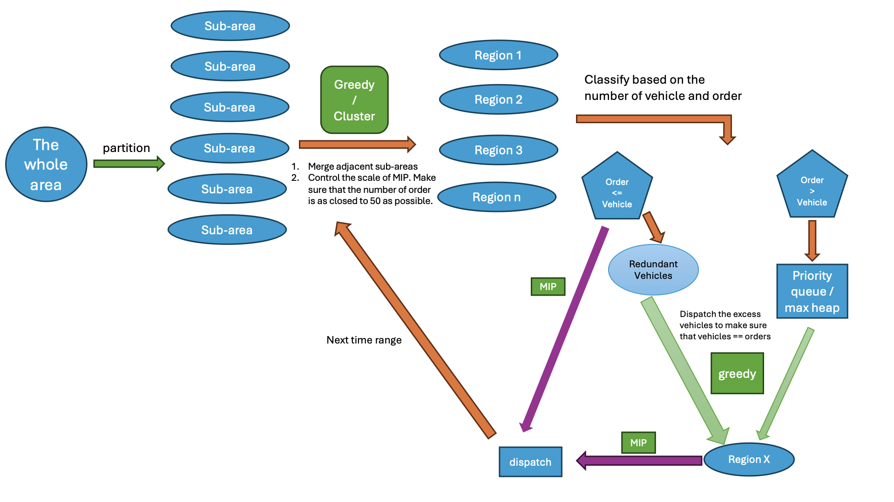

### The simulation process is as follows:

1. initialize all of vehicles in the city, generate the user requests based on the record from 滴滴 / NYC taxi, and init the map of Chengdu/ New York City.
2. in every time range (like 2 seconds), update vehicle's request and current situation (like, current position, if accecpt request, if accecpt car sharing, etc.).
3. Calculate the waiting time to pickup for every user request and the money they spend on the trip.

### The rule for vehicle-order:

1. One order is only for one user.
2. One car can accept up to two orders.
3. Three behaviors:
   1. Two people simultaneously hail a ride within a certain time range and decide to share the ride. The car will pick up Person A first, then Person B, and drop off Person A first, followed by Person B.
   2. A person willing to share a ride, Person A, is already in the car and the car has started the trip. Suddenly, a new carpool request from Person B is received. The car will then go from its current location to pick up Person B, drop off Person A, and finally drop off Person B.
   3. A person takes a ride from start to finish without any carpooling.

### The workflow:

1. Divide the whole city map into multi sub-areas.
2. In every time range:
   1. Based on the current relationship between requests and vehicles, utilize the greedy algorithm or cluster algorithm, and merge the adjacent sub-areas into one region until the number of order is as closed to 50 as possible (Control the size of MIP)
   2. Classify these regions into two types: 1. Number of order is greater than number of vehicles 2. Number of order isn't greater than number of vehicles.
      1. for type 2: MIP
      2. for type 1: dispatch the excess vehicles into busy area until the number of vehicle equals to the number of order, by using **greedy algorithm**/**LLM**. (LLM is not suitable for this part). Then MIP.
   3. Solve every MIPs with solver/LLM
   4. After determining the decision for every vehicles, running the simulation process.
3. Using the cost for every user and the waiting time as the metrics.

### Mathematical Formulation for Dispatch

Since the cost of calculating the distance using dijkstra algorithm is very expensive and unrealistic, we only calculate the manhattan distance when we build the MIP model. In the simulation process, using dijkstra algorithm to simulate car move.

#### Objective Function

The objective is to minimize the total Manhattan distance between vehicles and users, considering all segments of the vehicle paths:

$$
\min \sum_{i=1}^{n_1} \sum_{j=1}^{m} x_{ij} \cdot d_{ij} + \sum_{i=1}^{n_1} \sum_{j=1}^{m} \sum_{k=1, k \neq j}^{m} y_{ijk} \cdot (d_{ij} + d_{jk}) + \sum_{i=1}^{n_2} \sum_{j=1}^{m} z_{ij} \cdot d_{ij}
$$

where:
- $x_{ij}$ is a decision variable that indicates whether empty car $i$ is assigned to user $j$ (1 if yes, 0 if no).
- $y_{ijk}$ is a decision variable that indicates whether empty car $i$ is assigned to pick up user $j$ and then user $k$ (1 if yes, 0 if no).
- $z_{ij}$ is a decision variable that indicates whether car $i$ with one passenger willing to share is assigned to user $j$ (1 if yes, 0 if no).
- $d_{ij}$ is the Manhattan distance between vehicle $i$ and user $j$.
- $d_{jk}$ is the Manhattan distance between user $j$ and user $k$.

#### Constraints

the number of empty vehicles * 2 + the number of vehicles with one sharing order <= the number of coming order

1. **Each empty car either not assigned to any user or assigned to exactly two users**:

$$
\sum_{j=1}^{m} \sum_{k=1, k \neq j}^{m} y_{ijk} = 2b_i \quad \forall i = 1, \ldots, n_1
$$

2. **Each empty car can be assigned to at most one user directly**:

$$
\sum_{j=1}^{m} x_{ij} \leq 1 \quad \forall i = 1, \ldots, n_1
$$

3. **Each car with one passenger willing to share can be assigned to at most one user**:

$$
\sum_{j=1}^{m} z_{ij} \leq 1 \quad \forall i = 1, \ldots, n_2
$$

4. **Each user can be assigned to at most one vehicle**:

$$
\sum_{i=1}^{n_1} x_{ij} + \sum_{i=1}^{n_1} \sum_{k=1, k \neq j}^{m} y_{ijk} + \sum_{i=1}^{n_2} z_{ij} \leq 1 \quad \forall j = 1, \ldots, m
$$

5. **Each empty car must be assigned to at least one user if it is used**:

$$
\sum_{j=1}^{m} x_{ij} + \sum_{j=1}^{m} \sum_{k=1, k \neq j}^{m} y_{ijk} \geq b_i \quad \forall i = 1, \ldots, n_1
$$

6. **Linearization Constraints for $y_{ijk}$**:

$$
y_{ijk} \leq x_{ij} \quad \forall i = 1, \ldots, n_1, \forall j, k = 1, \ldots, m, j \neq k
$$

$$
y_{ijk} \leq x_{ik} \quad \forall i = 1, \ldots, n_1, \forall j, k = 1, \ldots, m, j \neq k
$$

$$
y_{ijk} \geq x_{ij} + x_{ik} - 1 \quad \forall i = 1, \ldots, n_1, \forall j, k = 1, \ldots, m, j \neq k
$$

